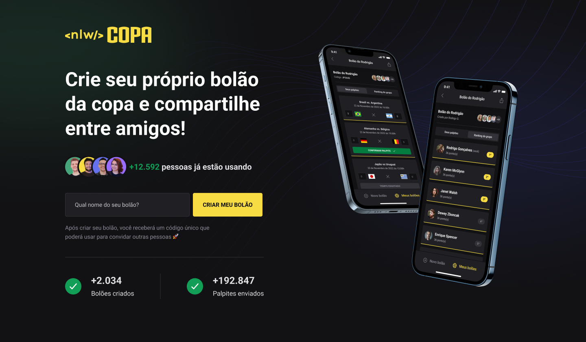
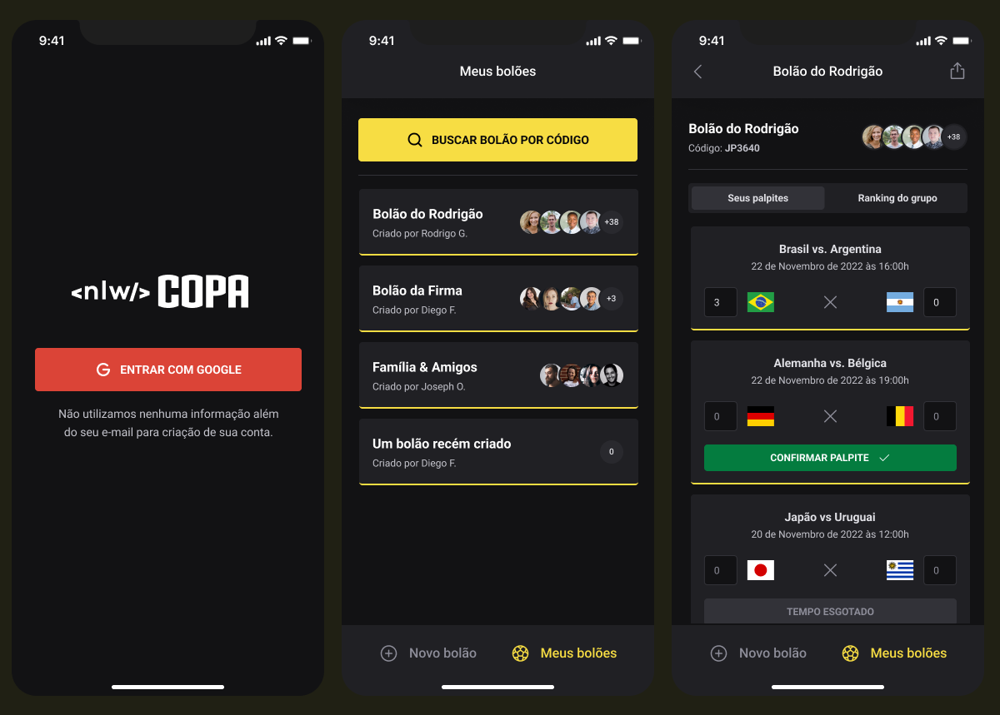

<h1 align="center"> NLW Copa </h1>

Evento exclusivo e gratuito, promovido pela Rocketseat para ensino de tecnologias WEB.

  <a href="#-tecnologias">Tecnologias</a>&nbsp;&nbsp;&nbsp;|&nbsp;&nbsp;&nbsp;
  <a href="#-projeto">Projeto</a>&nbsp;&nbsp;&nbsp;|&nbsp;&nbsp;&nbsp;
  <a href="#-layout">Layout</a>&nbsp;&nbsp;&nbsp;|&nbsp;&nbsp;&nbsp;
  <a href="#memo-licença">Licença</a>

  

 

  
  

## 🚀 Tecnologias

Esse projeto foi desenvolvido com as seguintes tecnologias:

- [React](https://reactjs.org/)
- [TypeScript](https://www.typescriptlang.org/)
- [Node e NPM](https://nodejs.org/)
- [NEXT.js](https://nextjs.org/)
- [Prisma](https://www.prisma.io/)
- [Fastify](https://www.fastify.io/)
- [React Native](https://reactnative.dev/)
- [Native Base](https://nativebase.io/)

## 💻 Projeto

O NLW Copa é um site/app para a criação de bolões, onde um usuário pode criar o seu próprio bolão e convidar as pessoas que quiser para se juntar

## 🔖 Layout

Você pode visualizar o layout do projeto através [DESSE LINK](https://www.figma.com/community/file/1169028343875283461). É necessário ter conta no [Figma](https://figma.com) para acessá-lo.

## :memo: Licença

Esse projeto está sob a licença MIT.
